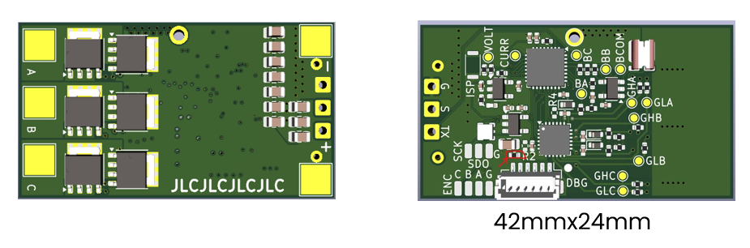

MR-ESC-MCXA-AM32 is a proof of concept Drone motor ESC (Electronic Speed Controller) motor controller, 
using NXP MCXA153 MCU and running the opensource AM32 software.

NOTE: This design is not supported by NXP motor control framework tools 
(it could of course be made to run with modifications)

Design files are in KiCAD.

Target MCU in AM32 directories is "a153"
Upstream repository for AM32 is here:
https://github.com/AlkaMotors/AM32-MultiRotor-ESC-firmware/tree/master

Interim AM32 enablement for MR-ESC-MCXA-AM32 is here:
(It will be upstreamed)
repo:NXPHoverGames/AM32-MultiRotor-ESC-firmware-MCXA
https://github.com/NXPHoverGames/AM32-MultiRotor-ESC-firmware-MCXA

